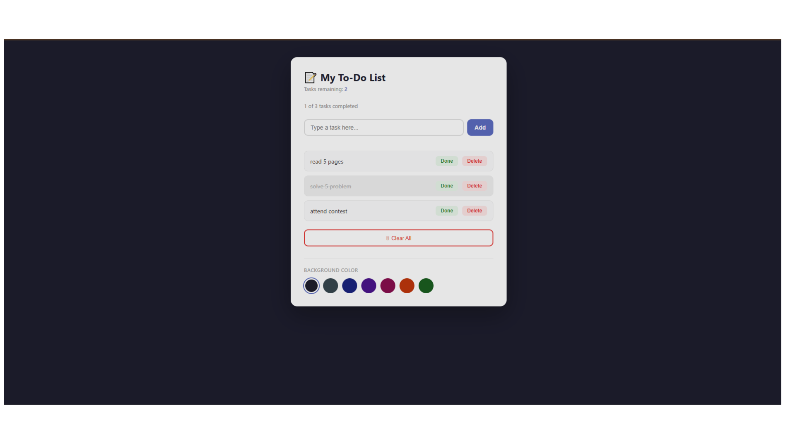

# 📝 To-Do List App

A simple and interactive To-Do List web application built using **HTML, CSS, and JavaScript**.  
It allows users to add tasks, mark them as completed, delete tasks, track progress, and customize the background theme.

---

## 🚀 Features

- ➕ Add new tasks
- ❌ Prevent duplicate tasks
- ✔️ Mark tasks as done / undone
- 🗑️ Delete individual tasks
- 📊 Live task counter (remaining tasks)
- 🎯 Progress tracker (e.g. `2 of 5 tasks completed`)
- 🎉 Completion milestone message when all tasks are done
- 🎨 Background color picker (theme switcher)
- 🧹 Clear all tasks at once

---

## 📸 Screenshot



---

## 🛠️ Tech Stack

- HTML5
- CSS3
- Vanilla JavaScript (ES6)

---

## 📂 Project Structure

project-folder/
│
├── index.html
├── style.css
├── script.js
└── screenshots/
    └── To-Do-list.png

---

## 📌 How It Works

Tasks are stored in a JavaScript array of objects:

```js
{
  text: "Task name",
  done: false
}
````

The UI is always synchronized with the array state.
All updates (add, delete, toggle done) update both:

* DOM (UI)
* Array (data model)

---

## 🎯 Learning Goals

This project helps practice:

* DOM manipulation
* Event handling
* Array methods (map, filter, some)
* UI reactivity without frameworks

---

## 📄 License

This project is open-source and free to use.


